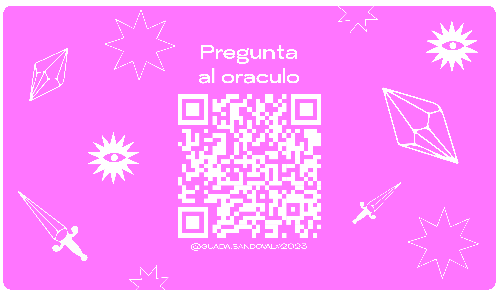

# 🔮 LET'S START

Oráculo es un wwebsite desarrollado en ReactJS con el objetivo de mergear el mundo de oficios con la tecnología.
Surgió como idea de presentacion para una muestra anual de cerámica cuyo tópico es A qué le rendís culto?
Se desarrolló en un sprint de una semana para poder cumplir con la fecha de la muestra y tener a tiempo el QR que luego se transfirió a una copa de cerámica.
Hasta el día de la fecha cuenta con 10 cartas con las que el usuario puede interactuar haciendole preguntas como en la práctica tradicional y obteniendo una carta como respuesta a través de Math.random().

## 🚀 Deploy

[Oráculo](https://oraculo-guadasandoval.vercel.app/)

